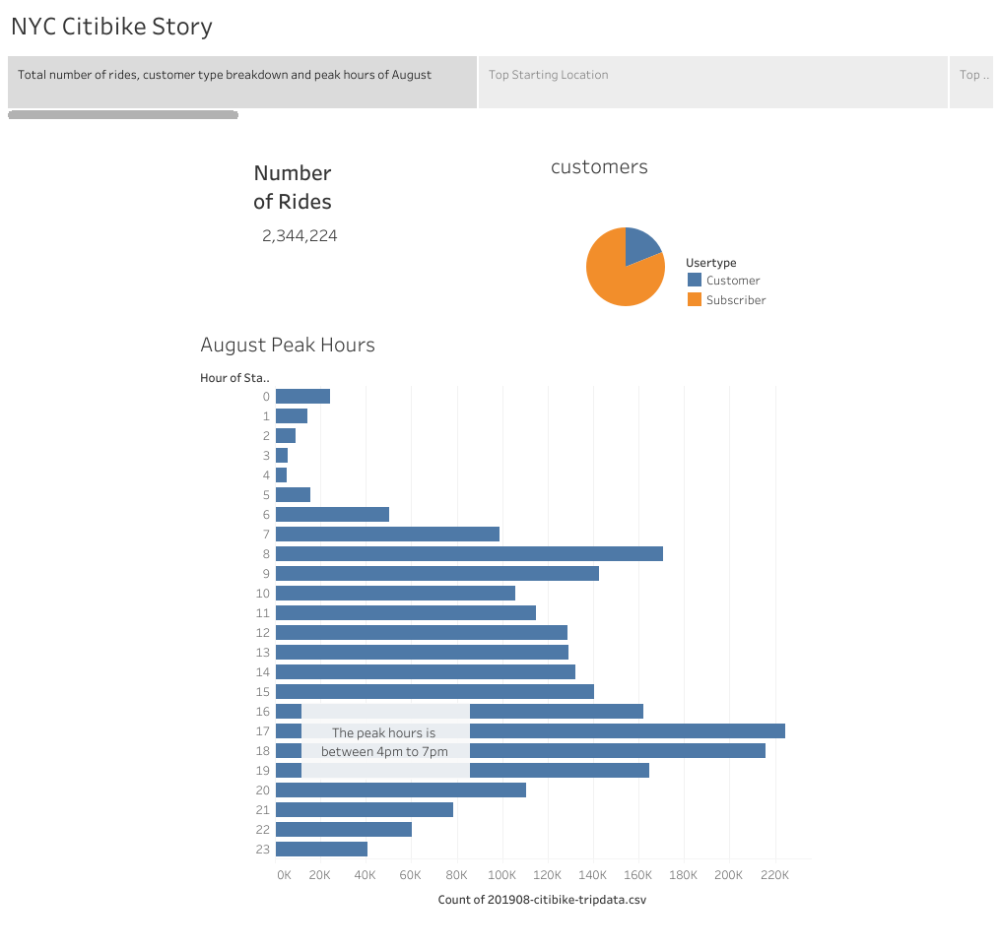
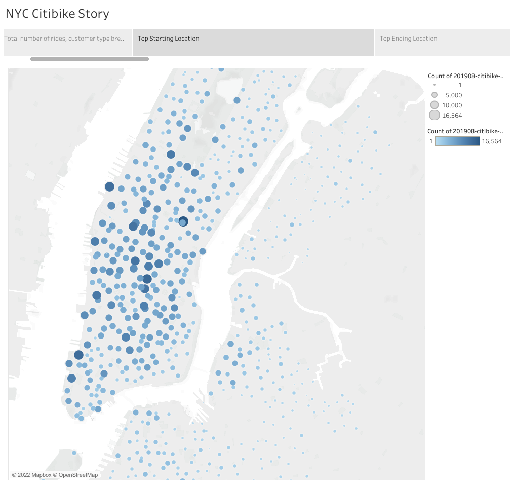
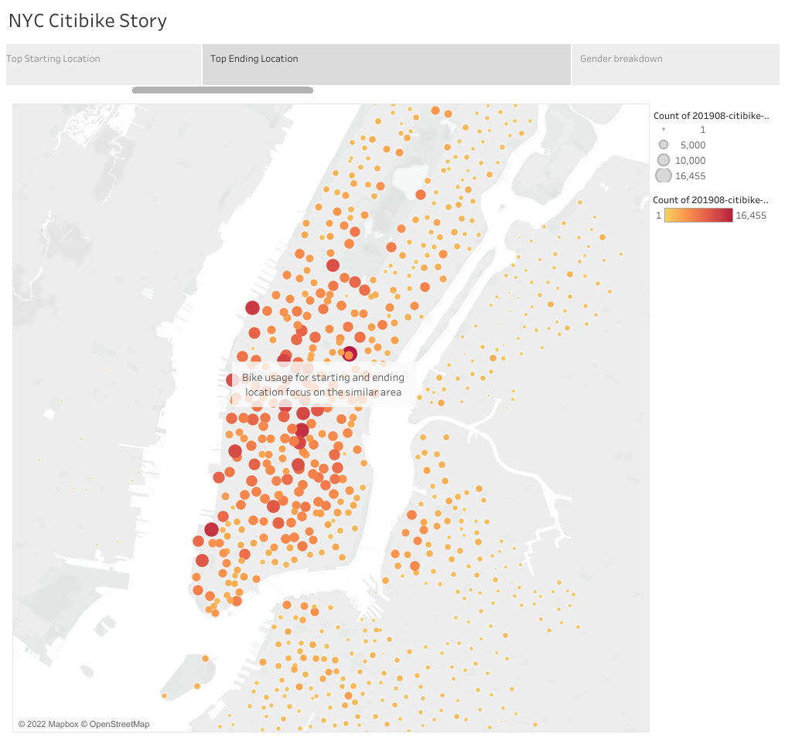
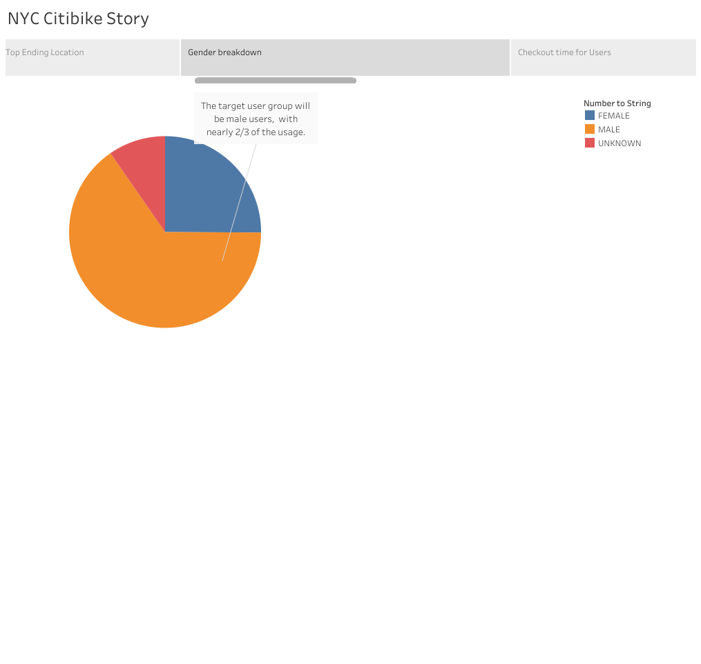
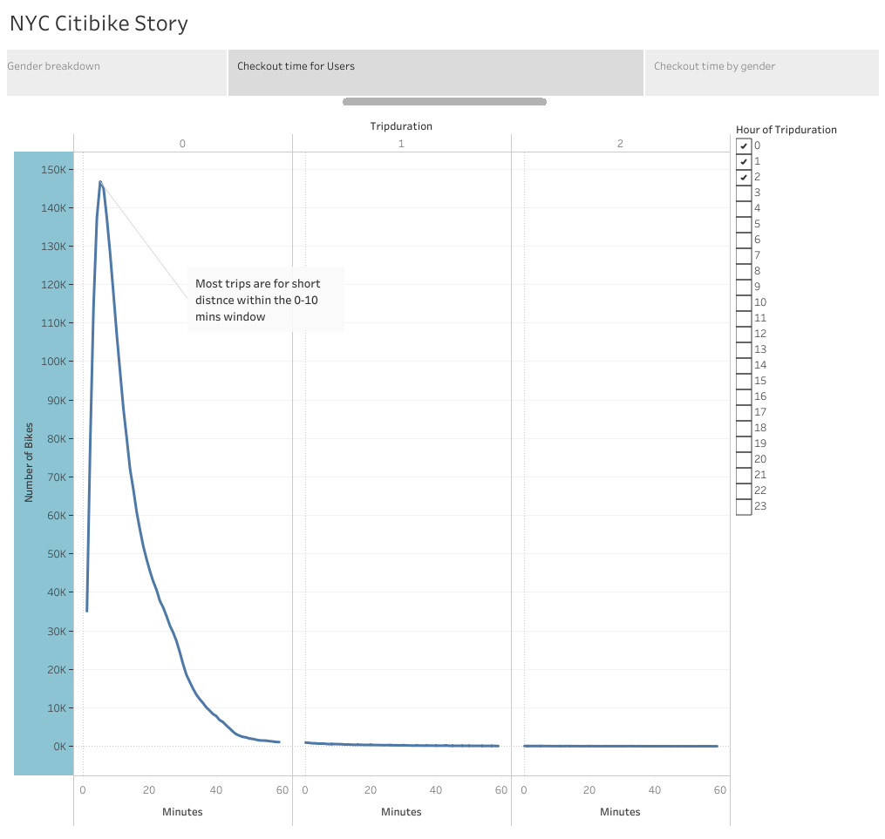
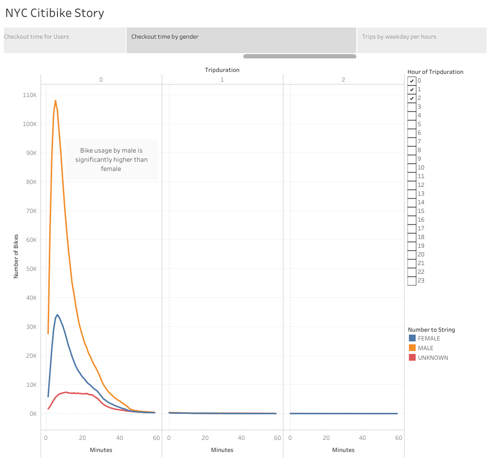
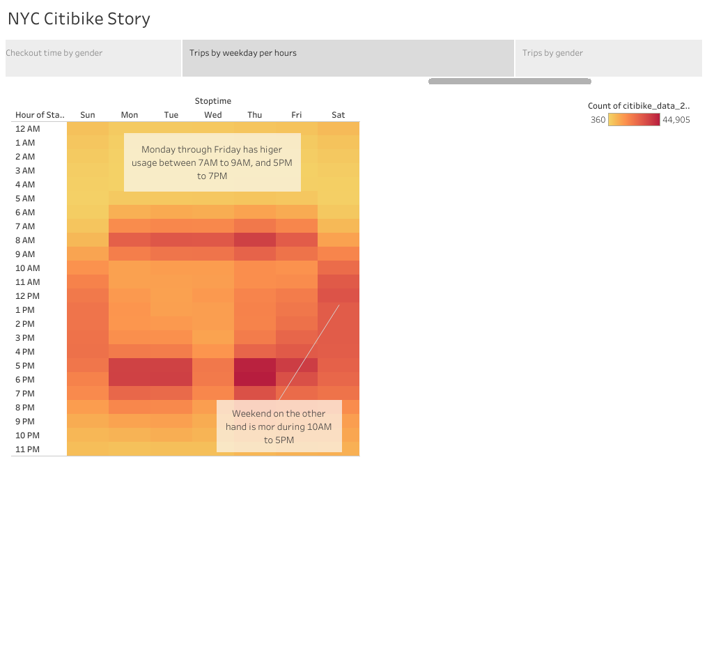
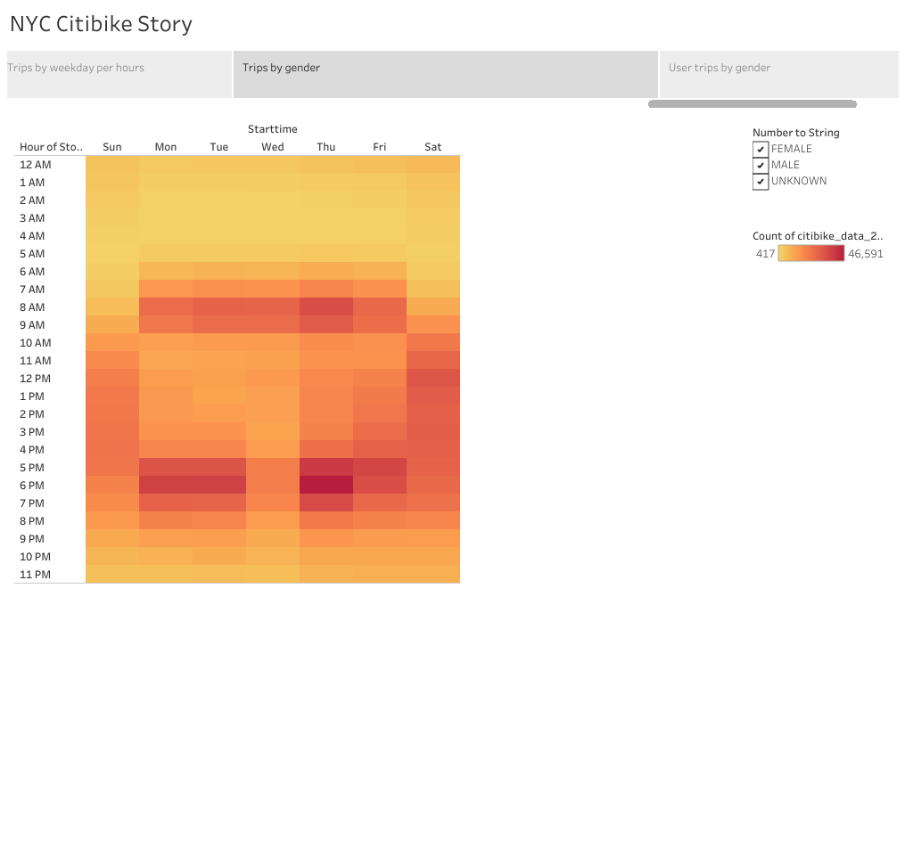
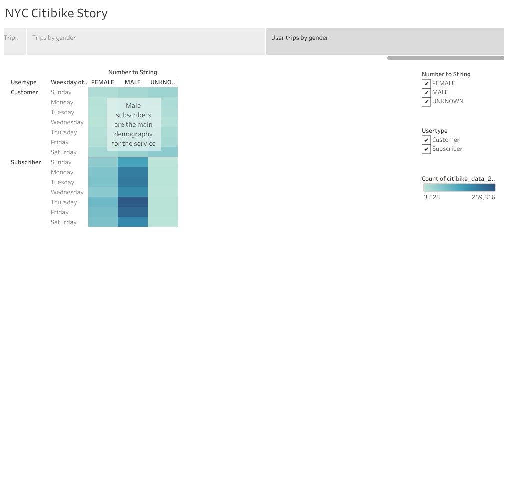

# The purpuse of the project
The purpose of this project is to use New York City's Citibike service as a model to analyze and determine if the bike sharing service will be a good business in Des Moines.

The data used in this analysis is NYC Citibike in August 2019.

# Results
[Link to Tableau Story](https://public.tableau.com/views/Module_14_16626744444110/NYCCitibikeStory?:language=en-US&publish=yes&:display_count=n&:origin=viz_share_link)

### Overview

From this visualization we can see that totoal rides in August 2019 is 2.344,224. And the service subscriber weight more than 75% of the total customers.
As for peak hours, we can see that during 4pm to 7pm have the highest usage, but also note that 7am to 8am also has a small peak. We can suspect that those peak hours are people using the service to commute to work.

### Top Starting Location

Here we can see that a lot of usage are in the lower Manhattan area, which could mean that there are more customers or people who commute to work from other parts of the city.

### Top Ending Location

From this visualization we can see that the top starting and ending location are in the similar area, which we can speculate that customer mostly used the service for short distance commute. Consider the subway system in NYC, it is possible that people use the subway for longer distance travel, then use the citibike service for the shorter distance to get to the destinations.

### Gender Breakdown

When it comes to the gender of the customer, we can see that male customer use the service much more than female and unknown.

### Checkout Time for Users

Here we can see taht most users use the service for under 10 mins, which confirmed that the user most use the service for short distance travelling.

### Checkout Time by Gender

From this visualization we can also see that male users are much higher than others, so we can see that male customer will be the target audience for the service.

### Trips by Weekday per Hour

Here we can see that the service usage have peaks 7am-8am, and also 5pm-7pm, which support the speculation that the customer could be using the service for commuting to work. On the weekend, the usage more focus on the late morning/early afternoon, customers could be using the service on the weekend more for leisure than to commute.

### Trips by Weekday by Gender

From this visualization we can see again the male users are the main customer base for the services.

### User Trips by Gender

Here we can see that overall the subscriber are more popular for New Yorkers. We can suspect that for the locals, becoming a subscriber make much more sense than customer, since they could be using the service on a daily basis. 

# Summary
The Citibike service in New York City are mostly used for short distance travels. Looking at gender breakdown of the customers, male has significantly higer usage than other genders. From the user type we can also see that subscribers are more popular than customers, which can mean that the service are used more by the locals than tourists. We also need to factor in the subway system in NYC, with the convenience of the public transportations, commute by car might not be the first choice for the locals, which can potentially be a possibility for the bikesharing service to be a popular choice in New York City.

When it comes to if the business model would be able to apply to Des Moines, we have to also consider how the local travels, if the local mostly travel by cars, which can mean the public transportation might not be as convenience as NYC. If so, the distance for traveling using bikesharing service could be longer, which can potentially lower customers' willingness to use the service for the commute purpose.
