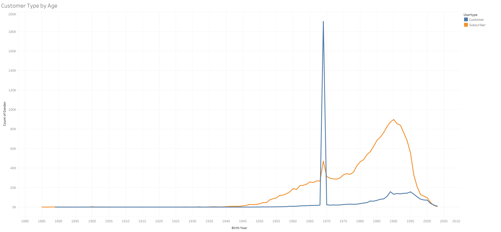

# The purpuse of the project
The purpose of this project is to use New York City's Citibike service as a model to analyze and determine if the bike-sharing service will be a good business in Des Moines.

The data used in this analysis is from NYC Citibike in August 2019.

# Results
[Link to Tableau Story](https://public.tableau.com/views/Module_14_16626744444110/NYCCitibikeStory?:language=en-US&publish=yes&:display_count=n&:origin=viz_share_link)

### Overview

From this visualization, we can see that the total number of rides in August 2019 is 2.344,224. And the service subscriber weighs more than 75% of the total customers.
As for peak hours, we can see that 4 pm to 7 pm has the highest usage, but also note that 7 am to 8 am also has a small peak. We can suspect that those peak hours are people using the service to commute to work.

### Top Starting Location

Here we can see that a lot of usage is in the lower Manhattan area, which could mean that some more customers or people commute to work from other parts of the city.

### Top Ending Location

From this visualization, we can see that the top starting and ending locations are in a similar area, which we can speculate that customers mostly used the service for short-distance commutes. Considering the subway system in NYC, people may use the subway for longer distance travel, then use the Citi bike service for the shorter distance to get to their destinations.

### Gender Breakdown

When it comes to the gender of the customer, we can see that male customers use the service much more than females and unknown.

### Checkout Time for Users

Here we can see that most users use the service for under 10 mins, which confirmed that the user most use the service for short-distance travelling.

### Checkout Time by Gender

From this visualization we can also see that male users are much higher than others, so we can see that male customers will be the target audience for the service.

### Trips by Weekday per Hour

Here we can see that the service users have peaks 7 am-8 am, and also 5 pm-7 pm, which supports the speculation that the customer could be using the service for commuting to work. On the weekend, the usage is more focus on the late morning/early afternoon, customers could be using the service on the weekend more for leisure than to commute.

### Trips by Weekday by Gender

From this visualization we can see again that male users are the main customer base for the services.

### User Trips by Gender

Here we can see that overall the subscriber are more popular among New Yorkers. We can suspect that for the locals, becoming a subscriber make much more sense than the customer, since they could be using the service daily. 

# Summary
The Citibike service in New York City is mostly used for short-distance travel. Looking at the gender breakdown of the customers, male has significantly higher usage than other genders. From the user type, we can also see that subscribers are more popular than customers, which can mean that the service is used more by locals than tourists. We also need to factor in the subway system in NYC, with the convenience of public transportation, commuting by car might not be the first choice for the locals, which can potentially be a possibility for the bike-sharing service to be a popular choice in New York City.

Here's the break down of customer types by age 

The subscriber type has a higher number of customers between the birth year the 1980s - 1995. Note that there is a peak in the year 1970 for customers, we will need to do some further investigation to see if those numbers are correct. I do have the suspicion that it could be the one-time customer type which might not have provided birth year information, but we will need further analysis to confirm this theory.

And here is the break down of trips duration by user type/gender

We can see that subscribers' total trip duration is almost double of regular customers, and the male subscriber has a much higher rate out of all subscribers. For the non-subscribing users, we can see that the gender unknown has the highest rate, we can suspect that when a non-subscriber uses the service, the gender might not be required information and therefore the unknown gender has the highest number out of non-subscriber.

When it comes to if the business model would be able to apply to Des Moines, we have to also consider how the local travels, if the locals mostly travel by car, which can mean that public transportation might not be as convenient as NYC. If so, the distance for traveling using a bike-sharing service could be longer, which can potentially lower customers' willingness to use the service for commute purposes.

Bikesharing in NYC is a great idea, the very concentrated population, and extensive public transportation, make the Citibike service perfect for people who need to only use the service for a short distance traveling. But Des Moines could have the potential for bike-sharing but will need to conduct a further investigation and make a business plan that will be better suited for it instead of copying NYC Citibike's model.

